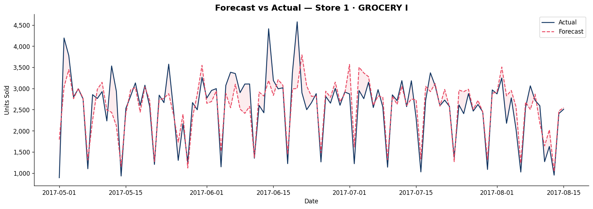
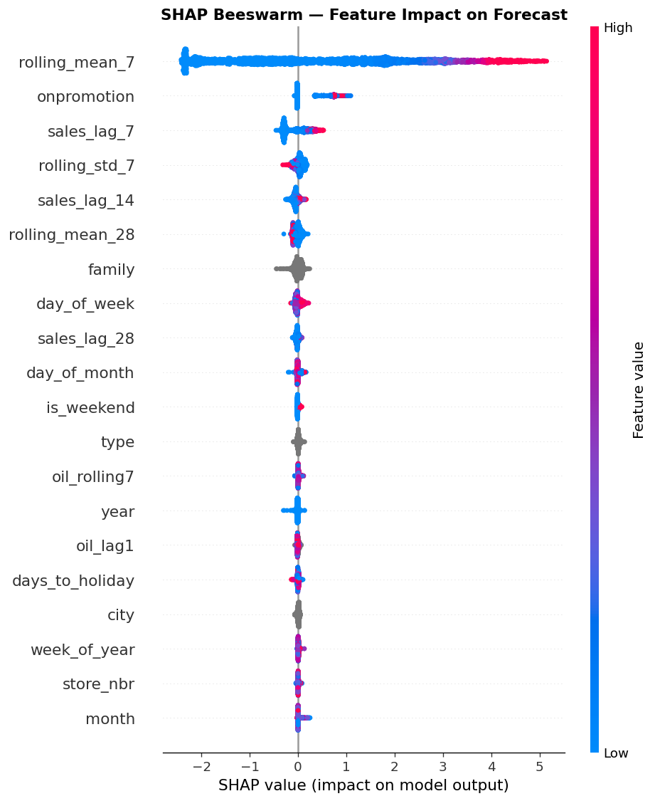
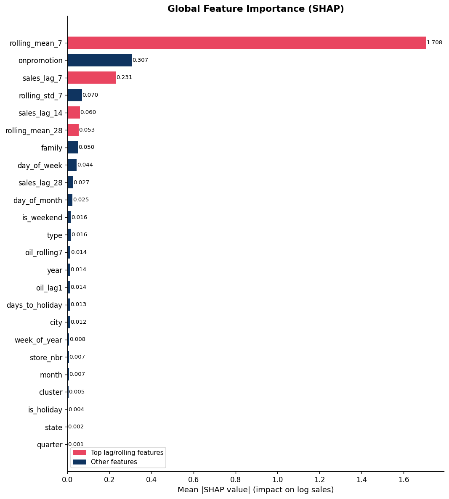
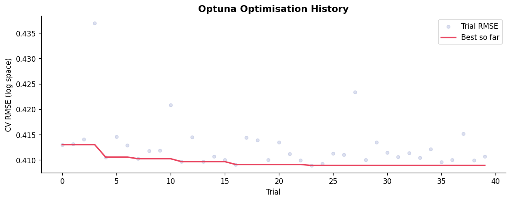
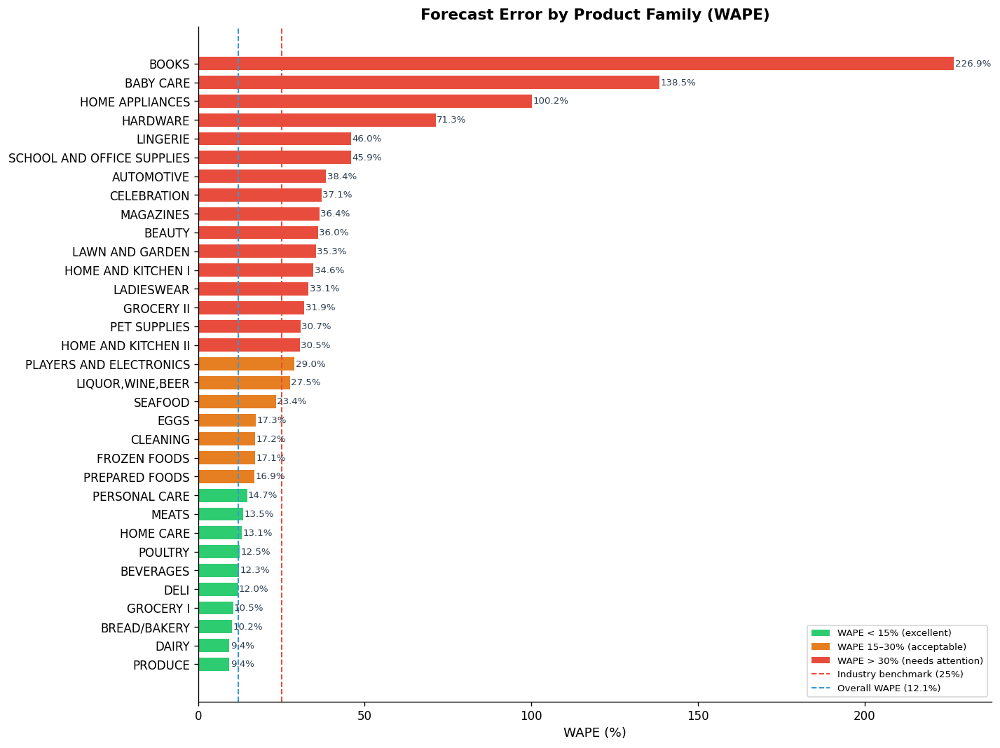

# 🛒 Retail Demand Forecasting

> End-to-end ML pipeline for multi-store retail demand forecasting using LightGBM + Optuna, SHAP explainability, quantile prediction intervals, and a Streamlit deployment.

[](https://www.kaggle.com/competitions/store-sales-time-series-forecasting)
[](https://www.python.org/)
[](https://lightgbm.readthedocs.io/)
[](https://optuna.org/)
[](https://mlflow.org/)
[](https://shap.readthedocs.io/)
[](https://streamlit.io/)
[](LICENSE)

---

## 📌 Business Problem

Inaccurate demand forecasts cost retailers millions annually through overstock write-offs and lost sales from empty shelves. This project builds a production-grade forecasting pipeline that predicts daily sales across **54 stores** and **33 product families** — with full explainability and supply chain business signals built in.

> A 10% reduction in forecast error directly translates to reduced working capital tied up in excess inventory and fewer stockout events that erode customer trust.

---

## 📊 Results

| Metric | Naïve Baseline | LightGBM + Optuna | Improvement |
|--------|---------------|-------------------|-------------|
| RMSE | 367.40 | 233.43 | ↓ 36.5% |
| MAE | 93.14 | 58.40 | ↓ 37.3% |
| WAPE | — | **12.10%** | ✅ Well below 25% industry benchmark |
| MAPE | 49.37% | 31.85% | ↓ 35.5% |

> **WAPE (Weighted Absolute Percentage Error)** is the industry-standard metric for retail forecasting. It weights errors by sales volume, preventing low-volume SKUs from inflating the overall error rate.

---

## 🔍 Key Findings

- **Recent sales history dominates** — `sales_lag_7` and `rolling_mean_7` are the top two SHAP drivers, confirming that last week's sales is the strongest predictor of this week's demand
- **Promotions drive measurable uplift** — `onpromotion` consistently pushes forecasts higher; the effect is stronger on weekends (visible in SHAP dependence plot)
- **Oil price has a secondary macro signal** — Ecuador's oil-dependent economy creates a measurable correlation between oil price and retail demand
- **Holiday proximity matters** — `days_to_holiday` captures pre-event demand spikes that a simple `is_holiday` flag misses

---

## 🗺️ Pipeline Overview

```
Raw CSVs → Data Prep → Feature Engineering → Modelling → Evaluation → SHAP → Streamlit App
```

| Step | Notebook | Description |
|------|----------|-------------|
| 01 | `01_data_prep.ipynb` | Load 4 CSVs, merge, clean, save parquet |
| 02 | `02_features.ipynb` | 25 features: lags, rolling stats, calendar, oil, holidays |
| 03 | `03_train.ipynb` | Naïve baseline → LightGBM + Optuna + MLflow tracking |
| 04 | `04_evaluate.ipynb` | RMSE/MAE/MAPE/WAPE per store & family + business signals |
| 05 | `05_shap.ipynb` | Beeswarm, waterfall, dependence plots |
| 06 | `app.py` | Streamlit 3-tab dashboard |

---

## 📈 Forecast vs Actual



---

## 🔍 SHAP Feature Importance



> Each dot is one prediction. X position = how much this feature pushed the forecast up or down. Color = feature value (red = high, blue = low).



---

## 📉 Optuna Optimisation History



---

## ⚠️ Business Signals

The evaluation notebook flags two actionable supply chain signals:

- **Stockout risk** — model under-predicted by >20% → store likely ran out of stock
- **Overstock risk** — model over-predicted by >20% → store likely holding excess inventory

These flags can drive automated replenishment alerts in a real supply chain system.



---

## 🧠 Feature Engineering (25 features)

| Group | Features | Signal |
|-------|----------|--------|
| Lag | `sales_lag_7`, `lag_14`, `lag_28` | What sold last week/month |
| Rolling | `rolling_mean_7`, `rolling_mean_28`, `rolling_std_7` | Smoothed demand trend |
| Calendar | `day_of_week`, `month`, `week_of_year`, `is_weekend`, `quarter` | Seasonality |
| Holiday | `is_holiday`, `days_to_holiday` | Event demand spikes |
| Oil | `oil_lag1`, `oil_rolling7` | Macro economic signal |
| Store | `store_nbr`, `cluster`, `type`, `city`, `state` | Location effects |
| Promo | `onpromotion` | Promotional uplift |

---

## 🏗️ Project Structure

```
retail-demand-forecasting/
├── 01_data_prep.ipynb       # Data loading, merging, cleaning
├── 02_features.ipynb        # Feature engineering (25 features)
├── 03_train.ipynb           # LightGBM + Optuna + MLflow
├── 04_evaluate.ipynb        # Per-store, per-family evaluation
├── 05_shap.ipynb            # SHAP explainability plots
├── app.py                   # Streamlit dashboard
├── images/                  # All output plots
│   ├── forecast_vs_actual.png
│   ├── shap_beeswarm.png
│   ├── shap_bar.png
│   ├── shap_waterfall.png
│   ├── wape_by_family.png
│   ├── optuna_history.png
│   ├── residual_analysis.png
│   └── daily_sales_trend.png
└── README.md
```

---

## 🚀 Quickstart

```bash
# Clone the repo
git clone https://github.com/SANKAR3006/retail-demand-forecasting.git
cd retail-demand-forecasting

# Install dependencies
pip install lightgbm optuna mlflow shap streamlit joblib pyarrow

# Run the Streamlit app
streamlit run app.py
```

---

## 📦 Dataset

[Kaggle Store Sales — Time Series Forecasting](https://www.kaggle.com/competitions/store-sales-time-series-forecasting)

| Property | Value |
|----------|-------|
| Rows | ~3,000,888 |
| Stores | 54 |
| Product Families | 33 |
| Date Range | 2013-01-01 → 2017-08-15 |
| External Signals | Oil price, national holidays, promotions |

---

## 🛠️ Tech Stack

| Tool | Purpose |
|------|---------|
| `LightGBM` | Gradient boosted tree model |
| `Optuna` | Bayesian hyperparameter search |
| `SHAP` | Model explainability |
| `MLflow` | Experiment tracking |
| `Streamlit` | Interactive dashboard |
| `pandas / numpy` | Data processing |
| `matplotlib / seaborn` | Visualisation |

---

## 👤 Author

**Sankar** — Data Analyst transitioning into Data Science
[GitHub](https://github.com/SANKAR3006)

---

## 📄 License

MIT License — free to use and adapt with attribution.
